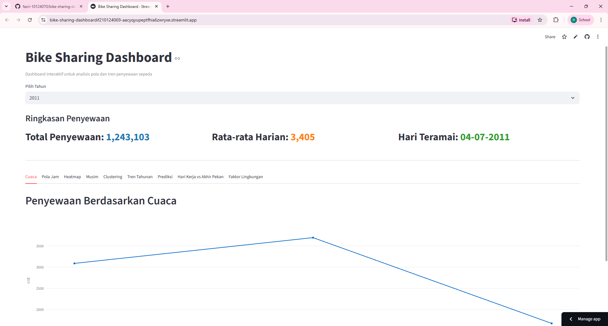

# Bike Sharing Dashboard

Project ini bertujuan untuk menganalisis pola penyewaan sepeda menggunakan
dataset Bike Sharing dengan memanfaatkan teknik analisis data dan visualisasi
interaktif melalui dashboard berbasis Streamlit.

Dashboard ini membantu memahami pengaruh faktor waktu, cuaca, dan musim
terhadap jumlah penyewaan sepeda, serta menyediakan analisis lanjutan
seperti clustering dan prediksi permintaan.

---

## Anggota Kelompok IF2

| NIM | Nama | Informasi Pekerjaan |
|-----|------|------|
| 10123318 | Jorge Fielnero Sauman | Analisis Notebook | 
| 10124051 | Raden Rama Feryl Alfaro | Membuat Dashboard Github Dan Membuat Desain Aplikasi | 
| 10124064 | M. Rifqi Afriza Fasha | Membuat Fitur Tambahan Pada Aplikasi | 
| 10124069 | Deni Solehudin | Analisis Notebook | 
| 10124070 | Fazri Hariri | Membuat Fitur Tambahan Pada Aplikasi | 

---

## Dataset
Dataset yang digunakan merupakan dataset Bike Sharing yang terdiri dari:
- day.csv : data agregasi harian
- hour.csv : data agregasi per jam

Dataset mencakup informasi cuaca, musim, hari kerja, dan jumlah penyewaan sepeda.

---

## Latar Belakang

Data penyewaan sepeda dapat digunakan untuk memahami kebiasaan pengguna serta faktor-faktor yang memengaruhi tingkat permintaan. Dengan melakukan analisis terhadap data historis, dapat diketahui pola penyewaan berdasarkan waktu, kondisi cuaca, dan musim tertentu. Hasil analisis ini diharapkan dapat memberikan gambaran umum mengenai karakteristik penggunaan sepeda dari waktu ke waktu.

---
## Rumusan Masalah

Berdasarkan latar belakang tersebut, analisis ini difokuskan untuk menjawab beberapa permasalahan berikut:
1. Bagaimana pengaruh kondisi cuaca terhadap jumlah penyewaan sepeda?
2. Pada jam berapa penyewaan sepeda paling tinggi, serta bagaimana perbedaannya antara hari kerja dan akhir pekan?
3. Musim apa yang memiliki jumlah penyewaan sepeda tertinggi?
4. Faktor lingkungan apa yang paling memengaruhi jumlah penyewaan sepeda?
5. Apakah terdapat tren peningkatan penggunaan sepeda dari tahun 2011 ke tahun 2012?

---

## Analisis yang Dilakukan
- Analisis penyewaan berdasarkan kondisi cuaca
- Analisis pola penyewaan per jam
- Analisis musiman penyewaan sepeda
- Heatmap hubungan hari dan jam
- Clustering hari berdasarkan tingkat penyewaan (sepi, normal, ramai)
- Prediksi penyewaan sepeda menggunakan regresi linear

---

## Tahapan Analisis Data

Tahapan analisis data yang dilakukan meliputi:

- Data wrangling, yang mencakup proses pengumpulan dan pembersihan data
- Exploratory Data Analysis (EDA) untuk melihat pola awal pada data
- Visualisasi data untuk mempermudah interpretasi hasil analisis
- Penerapan algoritma K-Means Clustering untuk mengelompokkan hari berdasarkan tingkat penyewaan
- Pembuatan dashboard interaktif menggunakan Streamlit

Notebook analisis lengkap tersedia dalam file .ipynb pada repository ini.

---

## Hasil Analisis

Berdasarkan analisis data yang telah dilakukan, diperoleh beberapa hasil sebagai berikut:

- Jumlah penyewaan sepeda tertinggi terjadi pada kondisi cuaca cerah
- Pada hari kerja terdapat dua puncak penyewaan, yaitu pada pagi dan sore hari, sedangkan pada akhir pekan puncak terjadi pada siang hari
- Musim Summer dan Fall memiliki jumlah penyewaan sepeda yang lebih tinggi dibandingkan musim lainnya
- Suhu merupakan faktor lingkungan yang paling berpengaruh terhadap jumlah penyewaan sepeda
- Terjadi peningkatan jumlah penyewaan sepeda dari tahun 2011 ke tahun 2012
- Hasil clustering menunjukkan adanya perbedaan pola hari sepi, normal, dan ramai berdasarkan kondisi lingkungan

---

## Dashboard Interaktif

Dashboard dapat diakses melalui link berikut:

https://bike-sharing-dashboardif210124069-aacyqyupeptfhia6zwryxe.streamlit.app/

Dashboard ini menyediakan beberapa fitur, antara lain:

- Filter data berdasarkan tahun
- Ringkasan statistik penyewaan sepeda
- Visualisasi penyewaan berdasarkan cuaca, jam, dan musim
- Heatmap penyewaan berdasarkan jam dan hari
- Hasil clustering
- Tren penyewaan tahunan
- Prediksi penyewaan 30 hari ke depan

---

## Cara Menjalankan Dashboard Secara Lokal
1. Clone repository ini
2. Install dependency:
   pip install -r requirements.txt
3. Jalankan Dashboard:
   streamlit run app.py

---

## Video Presentasi

Video dapat diakses melalui link berikut:

---

## Tools yang Digunakan

- Python
- Pandas
- Matplotlib
- Scikit-learn
- Streamlit

---

## Struktur Repository

- app.py – File utama untuk menjalankan dashboard Streamlit
- Bike_Sharing_Analysis_IF2.ipynb – Notebook analisis data dan clustering
- day.csv dan hour.csv – Dataset yang digunakan
- requirements.txt – Daftar library yang diperlukan
- README.md – Dokumentasi proyek
- dashboard.png – Tampilan dashboard

---
